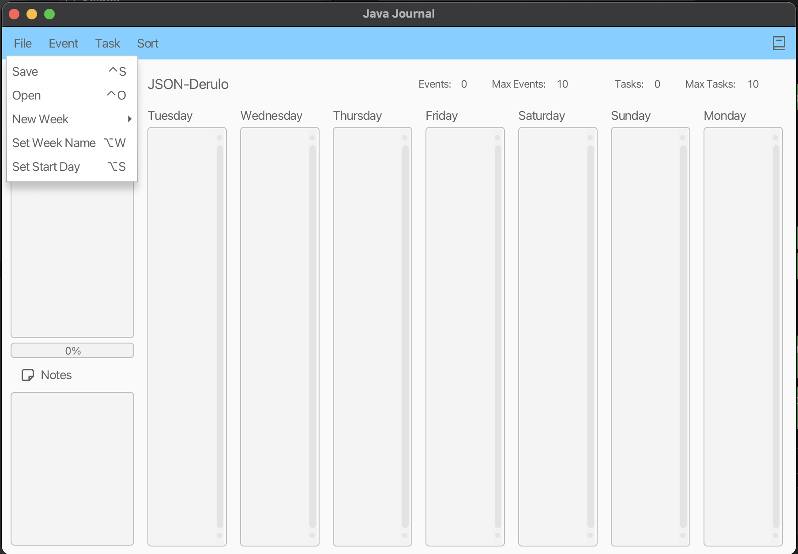

# JavaJournal
---  

## Features

Feature writeup:

Feeling behind on work? Overwhelmed by the lack of efficiency and Dr.Fontenot in your life?

The S.O.L.I.D bullet journal by Dr.JSON Derulo(TM) may be the solution for you.

Along with the core features of any good bullet(a week view, event and task creation, commitment
warnings, and a way to
save* your journals), we have implemented a series of fascinating new features!

### Saving:

You can save your journals in your file system by creating a new .bujo file first then selecting
that file in the file
chooser dialog. After saving the journal once during a session, the app will automatically save the
journal in the same
place again. If you are saving for the first time, you will be prompted to enter a new password
before the save
completes. The default password for journals is "hello".

### Opening:

When opening a journal file, you will be prompted for a password. The default password for journals
created by us is "
hello"

### Headlining Features:

#### 1. Task Queue:

You can queue up and sort your tasks in the sidebar, allowing for easy prioritization and the
ability to mark tasks as
complete

#### 2. Menu Bar & Shortcuts:

The extensive menu bar and shortcuts available allowing for an extremely user-friendly interface.
Along with the normal
commands(adding events and tasks, saving, opening, and creating a new week), we have created
commands for sorting
tasks/events, changing the week name, and many other useful features.

### Powerups:

#### 3. Quotes & Notes:

Feeling poetic after the muse hits? Write down your quotes in the notes section, which will persist
with the rest of
your journal for the rest of your lifetime

#### 4. Weekly Overview:

For the statistically-minded folks among us, the weekly overview provides statistics in the form of
total events/tasks
and event/task limit, as well the percent of tasks completed(as a progress bar)

#### 5. Sort by Name & Duration:

Using a keyboard command or the menu bar, you can sort the tasks and events using either the name or
the duration(if
sorting by duration, tasks will remain below while events are sorted above)

### Quality of Life:

#### 6. Week Start:

Maybe you think the week starts on Sunday. Maybe even on Monday. Hell, you can set the start of the
week to any day, with
the rest of the days following suit. Watch as your tasks re-order themselves! The chosen week start
will also persist
with the rest of your journal :)

#### 7. Task Search:

  
Perhaps you have 1000 tasks available. It might be hard to find them in the task queue. Using the
task search for the
name of a task, the names of relevant tasks and their completion status will appear before your
very eyes in the task
queue!

### Extra Credit:

#### 8. Deployable Application

To find and run the jar, please go to build -> fatJar -> pa05-template-1.0-SNAPSHOT.jar
Click on the jar file and run it like other normal jar files

#### 9. Visual Flourish:

Wow, the Dr.JSON Derulo photoshop really goes crazy. That’s some real attention to detail. And
wow, those icons are
so cool :) The design is truly a work of art.

#### 10. Splash screen:

    

_**Masterpiece. Click close to start.**_

#### 12. Privacy Lock:

    You will be prompted for a new password when you save your journal, and later when you try to
    re-open you better
    remember it! The default passcode is “hello” for the already saved .bujo files.

#### 13. Weekly Starters:

Really like the way you set one of your bullet journals up? Or maybe you are interested in using one
of the templates
created(HAPPY_NOTE_JOURNAL.bujo for instance!) The notes section is filled with truly happy stuff :)
You can use the
templates by going to File -> New Week -> Start from Template(or use shortcut ⌃⎇S)

### User Interface

  
---  

# Application of SOLID Principles

### S: Single-Responsibility Principle:

- Each of the Handler classes has one job: handle the click of a single button
- Similarly, each of the controller’s has a function to run(add task, add event, sort task, etc)
- By splitting the journal into multiple different sections: calendar vs notes, we were able to
  isolate the responsibilities different objects within the journal
- The calendar showed the week view, the notes only showed notes & quotes, etc.

### O: Open-closed Principle:

- All the event handlers extend a single SpecializedHandlerClass(which extends
  EventHandler<ActionEvent>
- We can provide additional implementations of the interfaces to extend the functionality, and
  interfaces are closed for modification but can be easily extended.
- All the controllers implement the JournalController interface, allowing for ease of polymorphism

### L: Liskov Substitution Principle:

- Instances of the EventHandler<ActionEvent> class can be replaced by subclasses without breaking
  the program
- Similarly, instances of the super event handler can be replaced with specialized event handlers
  and the functionality won't break because
  all of the public methods in the classes that implement interfaces are included in those
  interfaces.

### I: Interface Segregation Principle:

- Two interfaces exist for journals: one for JournalInteractable and one for JournalStatus
- JournalInteractable focuses on exposing methods for setting fields and other interaction between
  classes
- Journal status focuses on get data from object classes
- Classes that implemented interfaces utilize the methods such as journal implementation. Classes
  are not forced to implement an interface it doesn't use.

### D: Dependency Inversion Principle:

- We pass the journal interface from the master controller to every single sub-controller to
  manipulate(dependency
  injection), which allows for decoupling of classes since these high-level controllers depend on an
  interface instead
  of a concrete implementation.
- Abstractions and interfaces, such as calendar entry, are utilized to ensure that higher classes
  don't depend on
  concretions.

---  

## Opportunities for Extension

Themes: Based on how we used css, themes could be easily implemented with one line of code
by adding a new stylesheet to the java journal.

Links: Currently, the description is a Label object when shown on the week view, but we could easily
change that into a hyperlink label and add a handler

Mini viewer: Because of the way every handler extends Abstract handler, we could easily make the
tasks/events buttons that all implement a quick popup handler
  
---  

## Image Attributions

- Bharat Icons

---  

## Assignment Details

# 3500 PA05 Project Repo

[Fontenot PA Write Up](https://markefontenot.notion.site/PA-05-8263d28a81a7473d8372c6579abd6481)